# Project - Devops - MARTINEZ - CONCHEZ


## Description

This project aim to implement a web API app using Redis and an environment in order to auomate the building, testing and deployement of the project.

# Summary

- [Project-Devops-MARTINEZ-CONCHEZ](#project---devops---martinez---conchez)
  - [Description](#description)
- [Summary](#summary)
- [Instructions](#instructions)
- [1. Creation of the NodeJS web application](#1-creation-of-the-nodejs-web-application)
  - [Installation](#installation)
  - [Usage](#usage)
  - [Test](#test)
- [2. Application of CI/CD pipeline uning Heroku and GitHub Actions](#2-application-of-cicd-pipeline-uning-heroku-and-github-actions)
  - [Installation](#installation-1)
  - [Configuration of the workflow](#configuration-of-the-workflow)
  - [Test with Heroku](#test-with-heroku)
- [3. Application of the IaC approach](#3-application-of-the-iac-approach)
  - [Installation](#installation-2)
  - [Creating, Configuring and Provisionning our VM](#creating-configuring-and-provisionning-our-vm)
  - [Test](#test-1)
- [4. Build Docker image of the application](#4-build-docker-image-of-the-application)
  - [Installation](#installation-3)
  - [Usage](#usage-1)
- [5. Organization of Container with Docker Compose](#5-organization-of-container-with-docker-compose)
  - [Configuration](#configuration)
  - [Test](#test-2)
- [6. Organization of Docker with Kubernetes](#6-organization-of-docker-with-kubernetes)
  - [Installation of Minikube](#installation-of-minikube)
  - [Deploy our app using Manifest YAML files](#deploy-our-app-using-manifest-yaml-files)
- [Usefull links](#usefull-links)
- [Authors](#authors)

# Before starting

To clone the repository :

```bash
https://github.com/clement6494/project-devops-MARTINEZ-CONCHEZ.git
```

## Instructions

# 1. Creation of the NodeJS web application

## Installation

  This app is written with Nodejs and uses Redis database.
  
  * 1) [install NodeJs](https://nodejs.org/en/download/)
  
  * 2) [install REDIS](https://redis.io/download)

Go to the [userapi](./userapi/) directory of the application (where `package.json` file located) and run :

  ```bash
  npm install 
  ```
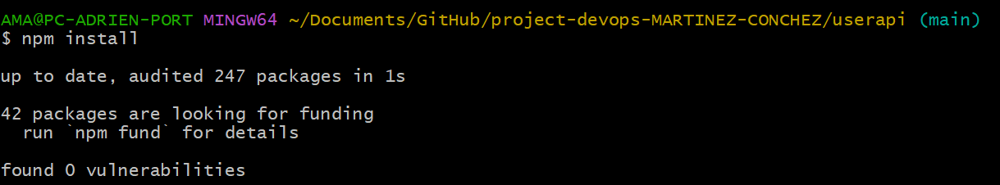

## Use the application
 * 1) Start a server
  
  From the [userapi](./user-api/) directory of the repository, use the command below:

```bash
npm run start
```
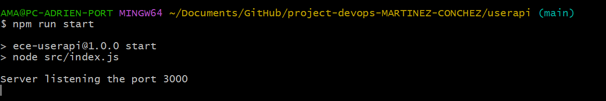

<http://localhost:3000> should be accessible and our web application will run (make sure to have the Redis server open) :

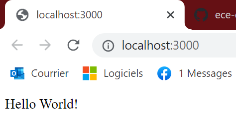

* 2) To create a user, send the curl POST request to the application with the user data :

```bash
curl --header "Content-Type: application/json" \
  --request POST \
  --data '{"username":"sergkudinov", "firstname":"sergei", "lastname":"kudinov"}' \
  http://localhost:3000/user
```
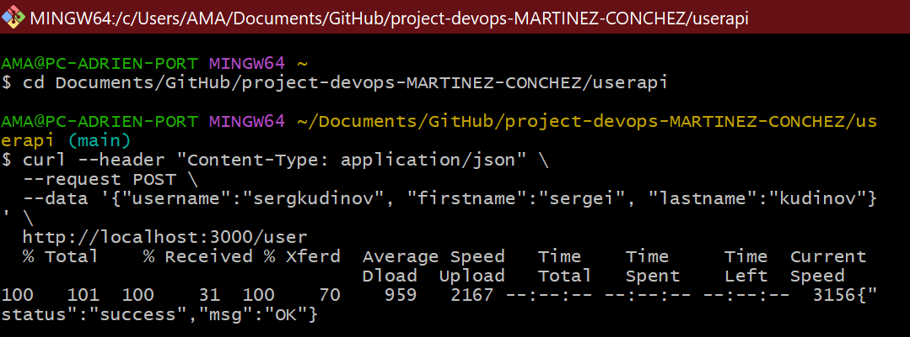

It should output:

```bash
{"status":"success","msg":"OK"}
```  

After, if you go to <http://localhost:3000/user/sergkudinov>, with "sergkudinov" being the username that you had in your POST data, it will display in the browser the following, with correspondance to the data that you posted :  

```bash
{"status":"success","msg":{"firstname":"sergei","lastname":"kudinov"}}
```
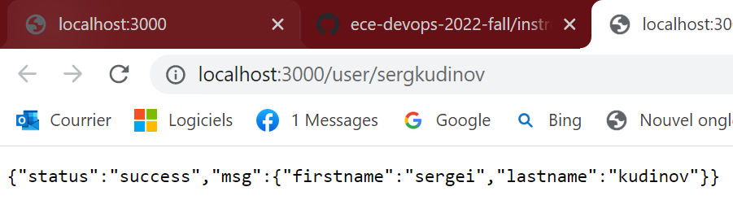

You can also use POST, GET , and DELETE.
UPDATE wasn't finished because we didn't undersood well what was the ID in the model given of username,firstname,lastname. So we didn't know what souldn't be change and used as ID.

## Test the application 

Go to the [userapi](./userapi/) directory of the application (where `package.json` file located) and run the command below:

```bash
npm run test
``` 
All 12 tests should be passed :  

# 2. Application of CI/CD pipeline using GitHub Actions and Heroku

* Continuous Integration is done with **GitHub Actions** :
  CI builds automatically and tests our project.

* Continuous Delivery using **Heroku** :
  CD shoulds deploy the project.
  To link the Github repo to Heroku, we added a secret key named {secrets.HEROKU_API_KEY} .
  (only theorical, we didn't trusted the app enough to give our credit card inormations so we couldn't test it out)


## Configuration of the workflow

We created an YAML file [.github/workflow/main.yml](./.github/workflows/main.yml)


# 3. Application of the IaC approach

* Configure the virtual environment: to start go to your folder, open PowerShell as administrator and run this command to be able to use virtualbox (and not automatically Hyper-V) :

```
Disable-WindowsOptionalFeature -Online -FeatureName Microsoft-Hyper-V-All
```
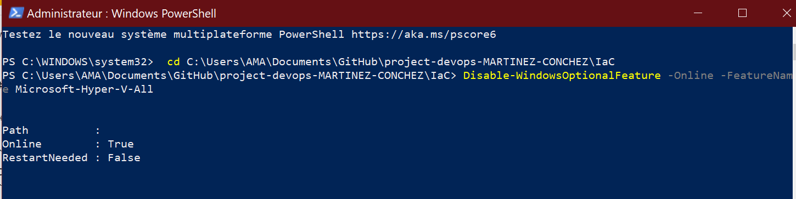

```bash
vagrant init hashicorp/bionic64
```
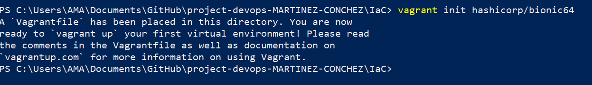

* Next we complete the vargrantfile to create a VM in the /iac directory and we use the command :

```bash
vagrant up
```
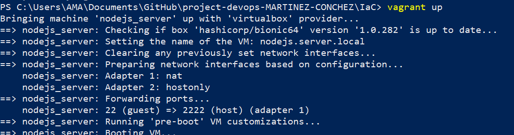

* It should have created the VM in VirtualBox:

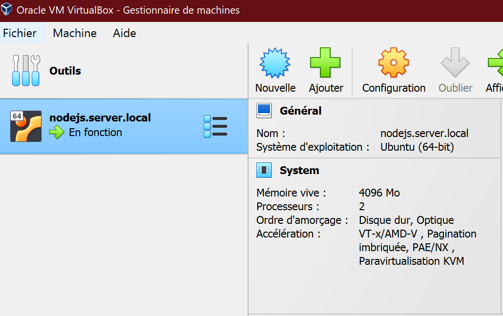

* We can now test the connection with SSH with the following command :
```bash
vagrant ssh
``` 
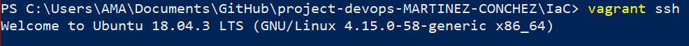

* We can naviguate through directories and see that our [userapi](/userapi/) folder in our local repository is shared with the VM. 
  
* Let's check in the folder exists in the VM : 
```bash
cd ..
cd user-api/
ls
```   
* The same folder in both the VM and the host :

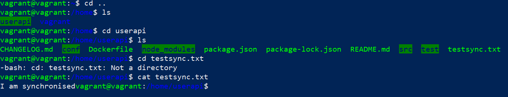

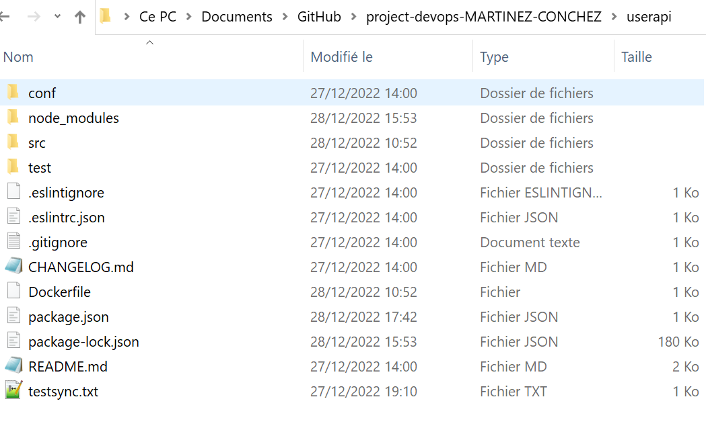

# 4. Build Docker image of the application

We use Dockerto package our app into standardized containers executable components combining the source code of the app with an OS, libraries and dependencies required to run our code throught any environment.

## Installation

  * [Docker Desktop](https://www.docker.com/get-started)
  
## Usage

* build an image of our app and pushed it in Docker Hub .

```bash
docker build -t ad123450/userapi .      
```
("-t ad123450/userapi) is optional and respresent the name we give to the image (userapi) and the user (ad123450)

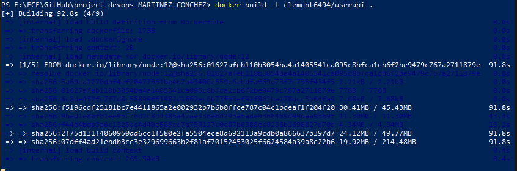

You should see this in you Docker Destop:

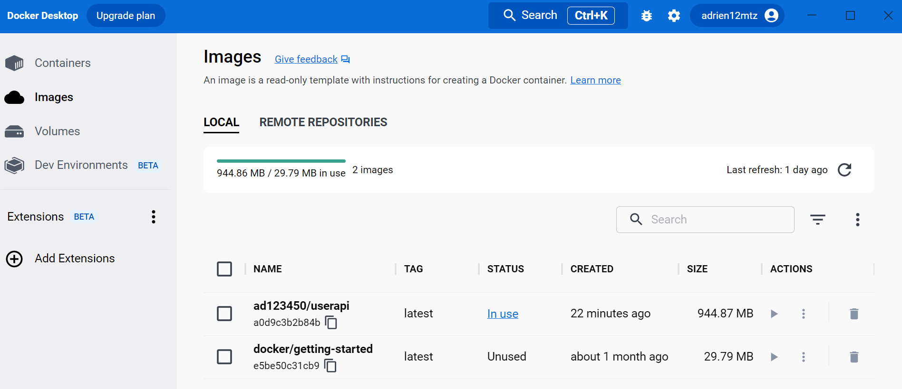

* In the [userapi](./userapi/) directory of the repo (i.e. where there is the [Dockerfile](/userapi/Dockerfile) ),run this in order to pull the image :

```bash
docker pull ad123450/userapi
```
* Check if  the image is correctly pulled to your local Docker images repo with the following command :

```bash
docker images
```

* Create the container :

```bash
docker run -p 12345:3000 -d ad123450/userapi
```
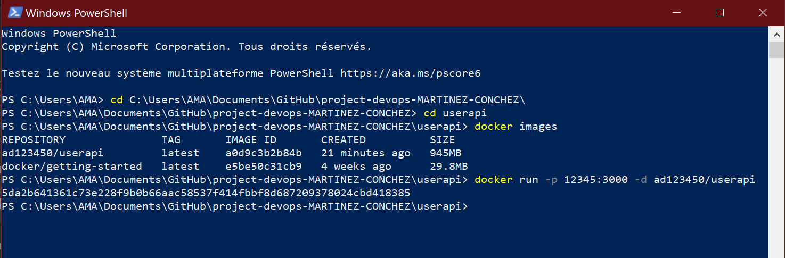

* To check running containers open another powershell page with our folder in with the following command :

```bash
docker ps
```  
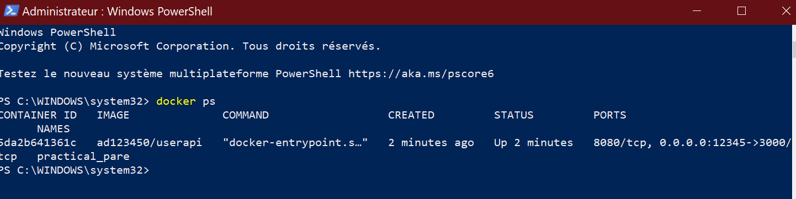

* Now you can open <http://localhost:12345/>, and the app should be launched :

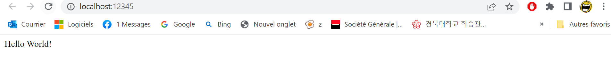

# 5. Organization of Container with Docker Compose

Docker Compose is a tool that was developed to help define and share multi-container applications. With Compose, we can create a YAML file to define the services and with a single command, can spin everything up or tear it all down.

## Configuration

* Add to the [`docker-compose.yaml`](docker-compose.yaml) file the userapi image :
example:

```yaml
version: '3'

services:
  redis:
    image: redis

  web:
    build: .
    ports:
      - "5000:3000"
    image: clement6494/userapi
```

## Test

* Run the container :
```bash
docker-compose up
```
* And go to <http://localhost:5000/> on your browser.
should expect:

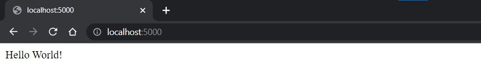

# 6. Organization of Docker with Kubernetes

Kubernetes is an orchestration framework for software containers. Containers are a way to
package and run code that's more efficient than virtual machines. Kubernetes provides the tools
you need to run containerized applications in production and at scale.

## Installation of Minikube

* [Install Minikube](https://kubernetes.io/docs/tasks/tools/install-minikube/) following the instructions depending on your OS.

* Start Minikube with:

```bash
set HTTP_PROXY=http://<proxy hostname:port>
set HTTPS_PROXY=https://<proxy hostname:port>
set NO_PROXY=localhost,127.0.0.1,10.96.0.0/12,192.168.59.0/24,192.168.49.0/24,192.168.39.0/24

minikube start --no-vtx-check
```
I had an issue with the vtx so i used this command to start minikube without it.

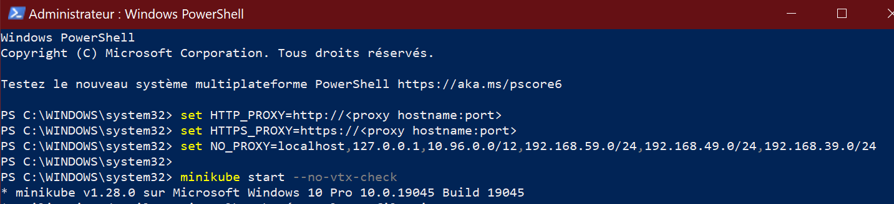

* Verify that everything is OK with:

```bash
minikube status
```
* Go in you folder
## Deploy our app using Manifest YAML files

* Configure the [`./k8s/deployment.yml`](./k8s/deployment.yml) file :

* run:

```bash
kubectl apply -f deployment.yml
```
* Once done, configure the [`./k8s/service.yml`](./k8s/service.yml) file :

* run :

```bash
kubectl apply -f service.yml
```

* Check the deployment running with :
  
```bash
kubectl get deployments
```  
* the state of services with :

```bash
kubectl get services
```
* And if the pods are running with :

```bash
kubectl get pods
``` 
[dashboard](https://minikube.sigs.k8s.io/docs/handbook/dashboard/) functionnality of Minikube gives a summary of the status through a dashboard running the following command will open a webpage :  

```bash
minikube dashboard
```

* Run the following command to open the port :
```bash
 kubectl port-forward service/userapi-service 5000:3000
```

The web application will be accessible at <http://localhost:5000/> :
 
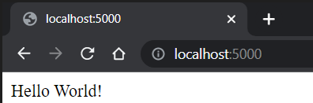

##  Usefull links


- Redis
- Docker Hub
- Minikube

## Authors


- Adrien Martinez: <adrien.martinez@ece.edu.fr> - ING4 gp5

- Clément CONCHEZ-BOUEYTOU: <clement.conchezboueytou@ece.edu.fr> - ING4 gp5

Copyright © Adrien Martinez & Clément CONCHEZ-BOUEYTOU, 2022

